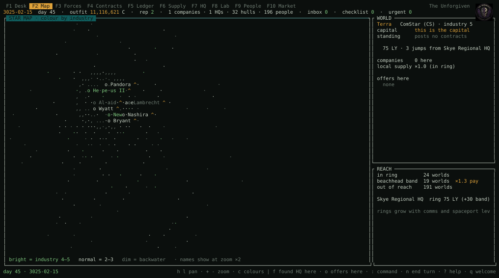
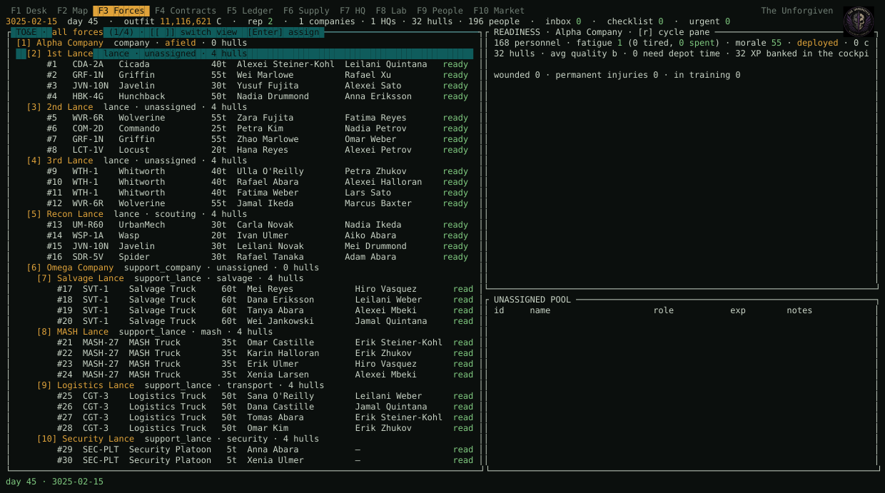
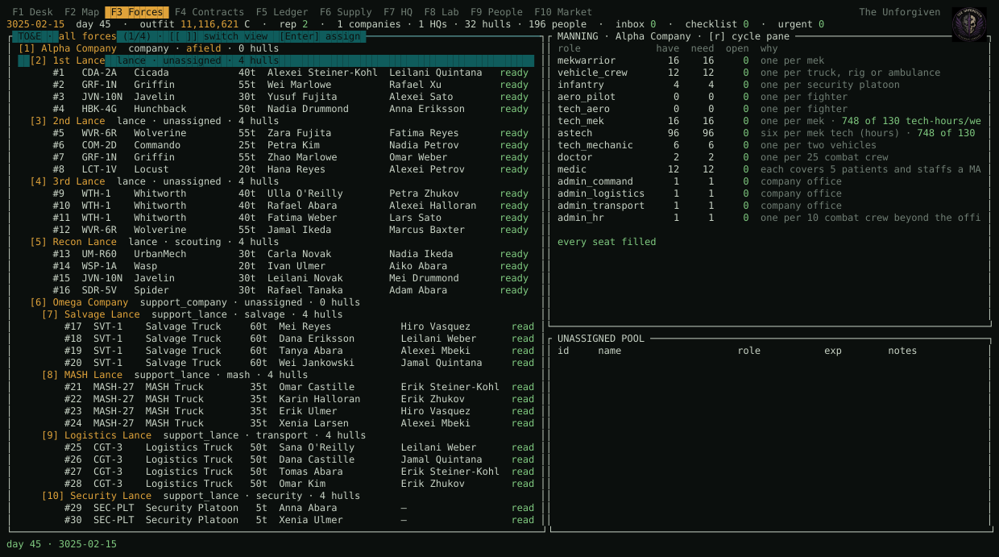
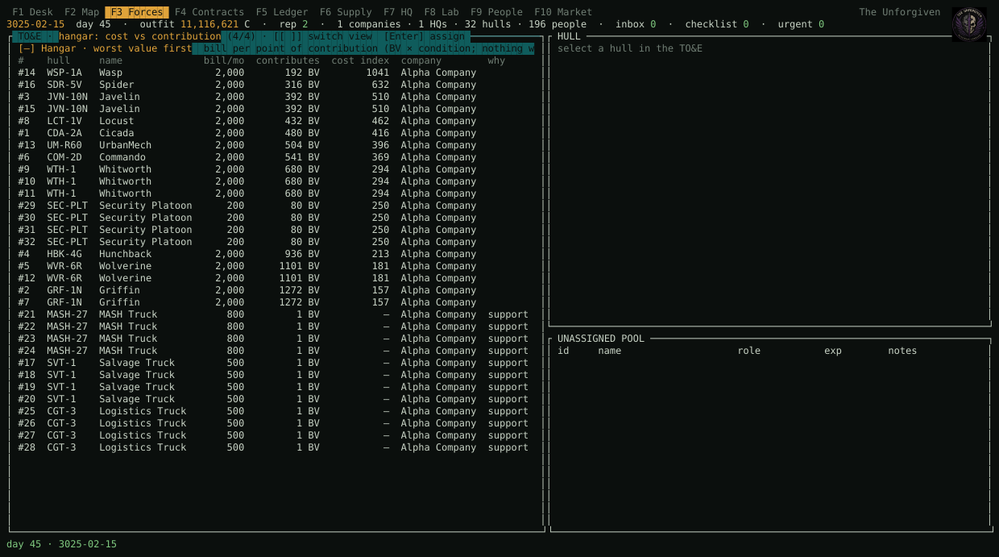
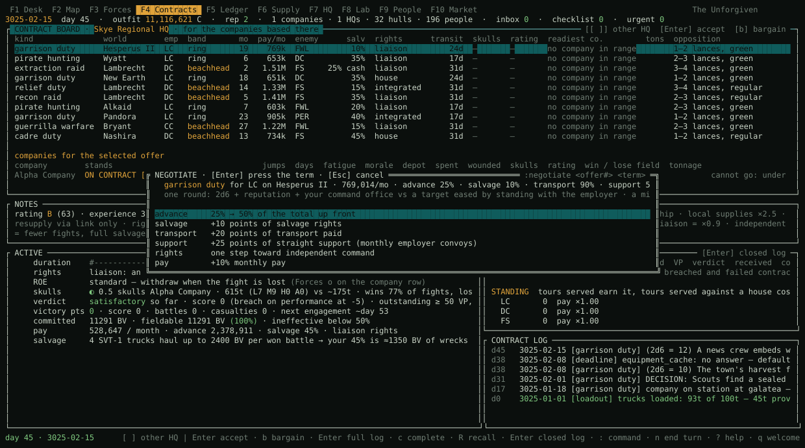
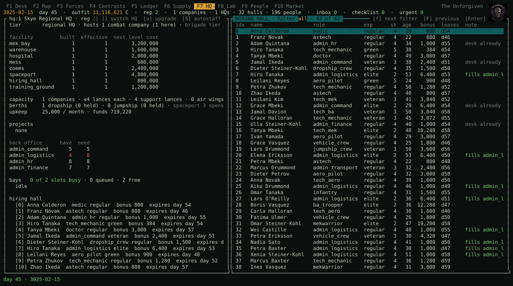
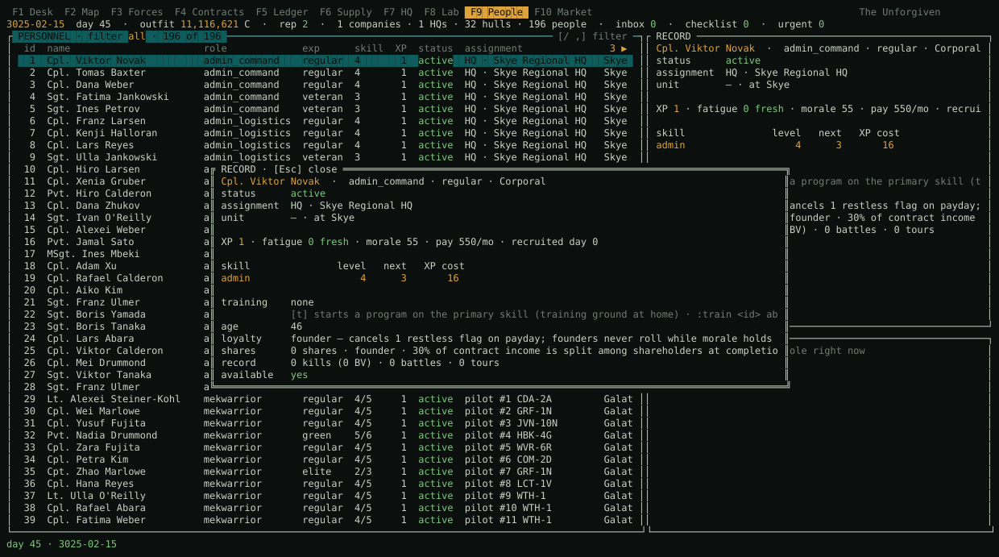
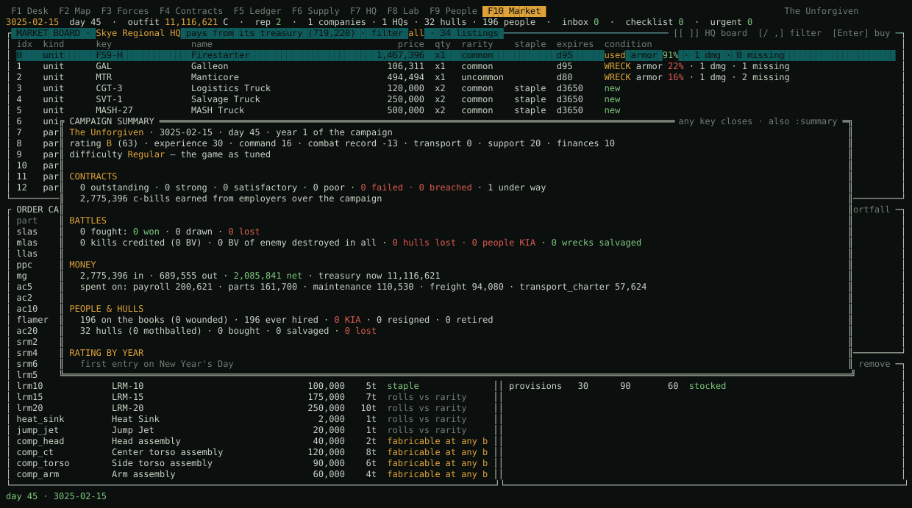
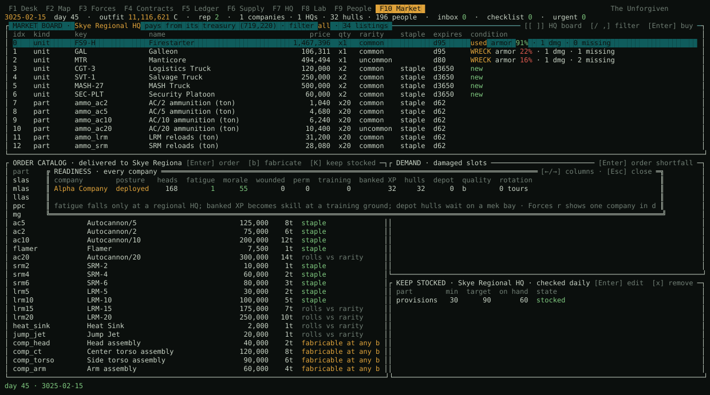
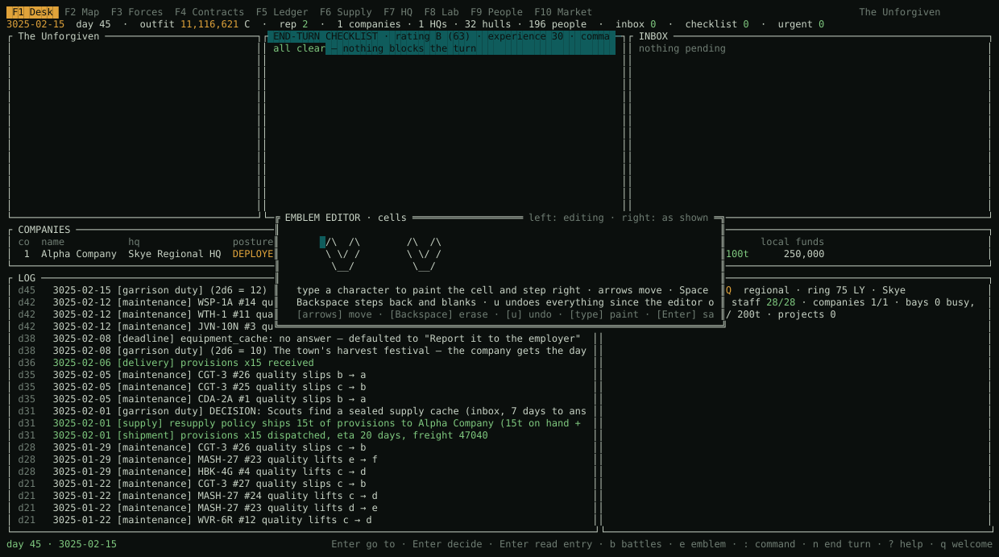

# IRON LEDGER

*A mercenary command in the Succession Wars.*


IRON LEDGER is a terminal game about running a BattleTech mercenary
outfit as an organisation: the people, the hulls, the money, the supply
lines and the headquarters that keep a company fighting. You are the
commander of the whole command, not a pilot. Battles resolve on their
own from what you built beforehand — training, maintenance, ammunition,
provisions, morale, support echelons, the depth of your bench — and the
after-action report tells you what your decisions were worth. The
tabletop is deliberately skipped; the campaign around it is the game.

It is written in Zig 0.16 with no dependencies beyond the system SQLite
library, runs in any terminal, and shows your outfit's crest as a real
picture on terminals that speak the kitty graphics protocol (Ghostty,
kitty, WezTerm, Konsole) or iTerm2's inline images.

Everything is turn-based. A day is a turn; nothing happens while you
think, and the end-turn checklist tells you what would slip if you ended
the day now.

## Features

### The outfit and its people

- **A commander, an outfit, an emblem.** Faction of origin places your
  starter regional HQ on a world in that house's space; profession grants
  a small permanent edge; the start year (3015–3030) decides which
  designs exist. Emblems are presets, an imported PNG, or a crest you draw
  cell by cell in the editor.
- **A generated company** of three line lances, a recon lance and a
  support company (salvage, MASH, logistics, security lances), rolled from
  your house's random assignment tables, with the back office sized by
  hand. Companies can also be raised empty and built hull by hull from the
  pool, cold storage and every HQ's market board, then crewed to
  complement in one press.
- **People are individuals**: role, skills on the MekHQ scale, experience
  band, age, rank (from seat and experience, or pinned by promotion),
  kills and BV credited per battle, tours served, awards, special
  abilities with Edge, a fatigue band that costs gunnery and piloting,
  morale, shares in the outfit, loyalty modifiers, per-location injuries
  with permanent scars, and a full record screen.
- **Careers**: the young learn faster, the old add a restless flag, and at
  65 they retire. Monthly service XP, weekly drill in training lances,
  and skill training at a training ground turn XP into levels.
- **Turnover is a decision, not a disappearance.** Anyone restless after a
  year in rolls to hand in notice on payday; the inbox offers a raise, a
  retention bonus, a replacement from the hall, or the door. Founders
  stand by the outfit while morale holds; veterans, a recent raise, a
  recent award and a stake in the shares all cancel restless flags.
- **Leaving costs money**: a month's pay per year served, capped, on
  notice or retirement; half on a firing; all of it when a company is
  disbanded. Shareholders take half.
- **Shares**: founders, veterans and officers hold shares; a configurable
  cut of every contract's income is paid out to them at completion.
- **Hiring halls** at every HQ churn daily with a floor under every role,
  arrivals scaled by hall level and biased toward whatever your companies
  are short of. Astechs and medics are hired to complement on demand,
  MekHQ-style.
- **Manning tables** per company — pilots, techs, astechs (as tech-hours
  covered against needed), mechanics, doctors, medics, office — with a
  checklist warning when any line runs short.
- **Medical**: wounds triaged and healed on doctor and facility timelines,
  a bed you admit them to (or auto-admit), MASH lances forward, medics
  who carry patients and staff beds, and a restless-crew line on the
  checklist.

### Contracts and combat

- **Twelve contract types** from garrison duty to planetary assault,
  priced off your fielded force, with victory points, an opposition pool
  to grind down on attrition work, duration objectives on garrison work,
  a performance-failure line and a breach clause.
- **Terms that matter**: command rights (integrated, house, liaison,
  independent) change battle cadence, salvage share, lance-role freedom,
  scoring and pay; salvage exchange pays the claim in cash; negotiation
  rounds improve one term against the employer's mood.
- **Faction standing** with every house: tours served and enemies fought
  move it, it prices pay and shuns you when it sours, and it feeds the
  event decks.
- **A Dragoons rating** from experience, command, combat record,
  transport, support and finances, F to A*, that sets how many offers
  reach the board, who hires you, what a planetary assault requires, the
  pay multiplier, your edge at the negotiating table and the quality of
  walk-ins at the hall. A fresh outfit starts C.
- **Scenario types** rolled per engagement by contract kind — stand-up
  fight, hold the line, breakthrough, ambush, convoy escort, base
  defence, recon in force, extraction — each with its own force ratio,
  roll shift, salvage access and score weight. Scouting lances take the
  edge off an ambush; a lost convoy escort hits the support train.
- **Terrain and weather**: every world has a terrain class and every
  battle rolls the weather. Close terrain evens the odds and dents recon;
  night, storms and dust ground the fighters; harsh conditions cost
  fatigue.
- **Detailed after-action reports**: power against power, every hit on
  record (which hull, what it lost, what happened to the crew), ammunition
  expended by family, what the trucks hauled, and salvage as things — whole
  wrecks and crated parts shipped home to the depot, never cash — after
  the liaison's cut.
- **Events with an inbox rule**: anything that only moves morale or
  fatigue is a dice roll logged automatically; anything that touches money,
  stock or damage lands as a decision with a deadline. Prisoners of war can
  be ransomed, released for standing, or recruited.
- **Morale from the field**: battle outcomes, weighted wins, a strong
  contract finish that lifts the whole outfit, a breach that shames it.
- **Contract history** with grade, world, days served, victory points and
  pay, and every AAR kept in the log.

### Logistics and the HQ network

- **Regional HQs project influence rings**; beachhead contracts let you
  found field HQs beyond them. A field HQ is a forward base: it hosts one
  company to rest, resupply and stage, its warehouse ships convoys to
  whichever deployed company it is nearest, and it lacks only what needs
  a facility it has not built. Raise it to regional through paperwork
  and construction. Facilities (mek bay, warehouse, hospital,
  mess, training ground, hiring hall, comms, spaceport) upgrade the same
  way and raise the staff you must keep.
- **The back office is staff**: command admins shorten paperwork,
  logistics admins work acquisition rolls, transport admins shave
  shipping, HR admins improve hiring and training, finance admins the
  books. Under-staffed facilities run a level lower.
- **Supply lines** carry tonnage between HQs with throughput limits; a
  dedicated line needs a jumpship you own.
- **Supplies are pallets**: munitions by family, armor, structural
  components, provisions and medical supplies, held in warehouses and in
  a deployed company's trucks. A field plan sizes floors and targets to
  the line's transit time; convoys leave when stock plus inbound drops
  under the floor; anything over target rides home.
- **Air wings, dropships and jumpships**: fighters fly in air lances under
  an air wing at a spaceport; owned ships berth at HQs, lift your
  companies for less charter, sail with them and come home with them.
- **Acquisition** rolls against each part's TechManual availability code,
  a periphery world's shelves and the HQ's comms reach; failed orders say
  why. Structural components can always be fabricated in a bay.
- **Markets** at every HQ: staples always, rare slots by rarity and
  industry, damaged hulls with a condition and repair bill, transports at
  bigger spaceports, and — at wired HQs with a hall — a fence's black
  market offer that may be a fraud.

### Money

- **Treasuries** per outfit, HQ and deployed company; cash moves by
  courier over real transit time. Standing top-up policies, loans at
  simple interest against a credit line, hull upkeep running or not,
  hardship pay on remote deployments, freight and charter.
- **A structured ledger** with a P&L in two periods, every transaction
  tagged by company, HQ and contract, and the liquidation value of
  everything you own. A negative treasury holds the turn; couriered funds
  count. Bankruptcy is game over.
- **A campaign summary** of contracts by grade, battles, kills and losses,
  money by category, people and hulls, and the rating year by year.

### Machines and maintenance

- **A curated 3025 catalogue**: 97 designs — 64 BattleMechs, 12 vehicles,
  11 aerospace fighters, 3 dropships, 3 jumpships and the support
  vehicles — with intro years, house random assignment tables, and 41
  parts with availability codes.
- **Weekly maintenance** by tech skill against a target from the hull's
  quality, with astech teams scaling the hour budget; hull hours grow with
  a worn or exotic machine and shrink in a veteran's hands. Quality drifts
  with the roll and prices resale.
- **Repairs in tiers**: field work by the company's techs from spares;
  structural work in an HQ mek bay over real bay time. Depot repairs and
  refits roll at the end: clean, a lingering fault, a redo, or a botch on
  a natural 2 — with the odds shown before you commit.
- **The MekLab** follows TechManual construction rules: tonnage, criticals
  per location, heat, ammo placement, armor per location. Refits are
  classed A–D and gated by the bay; removed mounts go back on the shelf.
- **Cold storage**: mothball idle hulls to stop the bills; reactivation
  takes bay time that depends on quality. A hangar view ranks every hull
  by cost against contribution.

### The universe

- **A 234-system star map** of the Inner Sphere and near Periphery with
  every house, the Periphery states, ComStar and the pirate bucket;
  colour lenses by faction, industry, standing and activity; influence
  rings and beachhead bands; offers pinned to worlds.
- **Era progression**: the market, house tables and salvage only field
  what is in service in the campaign year, and New Year's Day announces
  the designs entering service.

### The client

- **Ten screens** (Desk, Map, Forces, Contracts, Ledger, Supply, HQ, Lab,
  People, Market), a wizard, settings, modals for readiness, records,
  hulls, negotiation, the summary and the emblem editor, and a `:` command
  line with Tab completion that takes every console verb.
- **Layouts that degrade** from a maximised terminal to 80×24, `--ascii`
  borders, 24-bit or 256 colours, and half-block pictures where no
  graphics protocol exists.
- **A soundtrack** through the system's command-line player: every audio
  file under `data/music/` plays, loose files as the default soundtrack
  and each sub-directory (`data/music/lyran/`, `data/music/pirates/` …)
  as a soundtrack of its own. All of them are mixed into one playlist
  and reshuffled every launch; `:music` browses soundtracks and tracks,
  picks one soundtrack or the mix (remembered between runs), and plays a
  track on demand. `M` toggles music anywhere; Settings has previous,
  next and volume; the status strip names what is playing.
- **Players own campaigns** in one SQLite file, with schema migrations
  that carry old saves forward.

### Data and engineering

- **Every table is data**: designs, planets, parts, tuning knobs, MekLab
  tables, names, ranks, awards, abilities, RATs, factions, scenarios,
  terrain — `.zon` files imported at compile time into typed structs.
  `zig build -Ddata=<dir>` overlays any of them from a mod directory
  ([docs/modding.md](docs/modding.md)).
- **A pure, deterministic core**: no I/O, no wall clock, integer C-bills
  and basis points, named RNG streams, commands as a tagged union, a
  golden-master hash. The terminal client and the console share one
  parser and one command/query boundary. 220-odd tests, a pseudo-terminal
  smoke test of the client, and a scripted smoke of the console.

## Running it

Requirements: [Zig 0.16](https://ziglang.org/download/), the system SQLite
library (present on macOS; `libsqlite3-dev` on Debian/Ubuntu), and for
music a command-line player on `PATH` — `afplay` (macOS), `mpv`, `ffplay`
or `aplay`.

```sh
zig build test --summary all      # the test suite
zig build run -- --tui            # the game
zig build run -- --tui --ascii    # plain-ASCII borders for terminals that draw box glyphs double-width
zig build run -- --repl           # the scripting / debug console
zig build run                     # a scripted demo campaign
zig build -Ddata=mymod            # build with a mod directory overlaying data/
```

Flags: `--store <file>` picks the save file (default `campaigns.db`, one
file holds every player and campaign); `--no-splash` and `--no-music` for
scripts. A maximised terminal at a 14–16 px font gives the full layout;
everything degrades down to 80×24.

### Keys

| Everywhere | |
|---|---|
| `F1`–`F10` or `1`–`9`, `0` | screens: Desk, Map, Forces, Contracts, Ledger, Supply, HQ, Lab, People, Market |
| `Tab` / `Shift-Tab` | move between panes |
| `j` `k` or arrows, `Enter` | move the cursor, act on the row |
| `:` | command line with Tab completion (every console verb works here; `:summary`, `:readiness`, `:manning co:N`) |
| `n` / `N` | end the turn / end seven turns — the checklist opens first |
| `?` | help · `e` emblem · `F12` settings · `M` music on/off · `:music` soundtrack browser · `q` back to the welcome screen |

Each screen's own keys are on its bottom line.

## The screens

### Welcome and settings

Players own campaigns. Continue, create or delete a campaign; create or
delete a player. Deleting asks for the name typed back. Settings hold the
music switch, volume, previous and next track, the soundtrack browser
(`t`), medbay auto-admit, the profit share paid to shareholders, the
graphics path in use and where the data came from.


### New campaign

Four steps: commander (name, house of origin, profession, start year),
outfit and emblem (presets, or import a PNG from `./`, `logos/` or
`docs/logos/`), the generated company with the back office sized by
hand, and a review.


### F1 Desk

Where a turn starts and ends: the end-turn checklist (blocking items in
red) under the outfit's Dragoons rating, the inbox with decisions and
their deadlines, every company's posture, the log since last turn, and
the HQ network.


### F2 Map

The star map from the planet table: influence rings and beachhead bands
around each HQ, offers pinned to worlds, deployed companies marked,
worlds you have worked. `h j k l` move between worlds and the view
follows; `+` and `-` zoom; `c` cycles the colour lens — faction,
industry, standing, activity; `f` founds an HQ on the world under the
cursor; `o` jumps to its offers.




### F3 Forces

The TO&E as a tree with pilot, tech and state per hull, paged with `[`
and `]` between all forces, each company, the unassigned pool and the
hangar ranking. With the cursor on a company, `r` cycles the right-hand
pane between DAMAGE (the components the home warehouse must have
ready), READINESS (fatigue bands, morale, wounded, permanent injuries,
banked XP, depot hulls, rotation) and MANNING (every role's have, need
and open, with tech-hours covered). `c` crews the company to complement
from the halls, `A` auto-assigns seats, `w` raises an air wing, `+`
raises a new company through a wizard, `o` sets a lance's role, `d`
sends a hull to the depot, `m` mothballs it, `R` recalls a company, `$`
sells a hull, `X` disbands.








### F4 Contracts

The board with every column that matters — kind, world, employer, band,
months, pay, enemy, salvage, command rights, transit — and the active
contract with its opposition pool, duration, victory points, breach
exposure, salvage capacity and battle history. `b` opens a negotiation
round on an offer. A HISTORY pane keeps every closed contract with its
grade, world, days served, victory points and pay; a STANDINGS pane
shows every house's opinion of you; the notes line carries your rating.




### F5 Ledger

Money lives in places: treasuries, couriers in transit, standing top-up
policies, loans against the credit line, the liquidation value of
everything you own, a P&L in two periods, and the transactions.


### F6 Supply

Every warehouse and field store as a tonnage bar; the selected site's
stock as a table; everything inbound with delivery days and, for a
failed order, why it could not be sourced. On a company row: `t` sends
cash by courier, `p` sets a top-up policy, `P` a resupply policy, `s`
ships provisions from home, `o` orders straight to the field, `R` trims
the stores to the field plan, `H` ships spare components home. On an HQ
row `K` sets a keep-stocked line and `$` sells part of a line.


### F7 HQ

Facilities with built and effective level, the tier line and what a
regional upgrade costs (`T`), bays and their queue with each repair's
odds, projects, the back office against its requirement (`S`
autostaffs), and the hiring hall (`Tab`) with a role filter, bonuses,
ages and how long each candidate stays.




### F8 Lab

The MekLab: tonnage budget, crits per location (dim = full), structure
state with the component it needs, mounts, the staged plan with the
rules' verdict, the bay queue at home. `+` picks a part and then a
location the rules allow; `R` orders a replacement for damaged gear;
`D` sends the hull to the depot for structural work; `Enter` commits the
refit and shows its odds.


### F9 People

Everyone on the payroll with status, assignment and location. `/` cycles
the filter (combat, techs, medical, each office desk, other, unassigned,
wounded). `r` opens the record: skills with XP costs, rank, age,
loyalty, shares, kills, tours, awards, abilities, injuries. `m` admits
the wounded, `t` trains a skill or ability, `a` seats a person, `P` posts
them to an HQ, `x` transfers them, `L` grants leave, `D` fires (the
severance owed is shown first).




### F10 Market

The site boards for hulls, parts and ammo — staples, rare slots, damaged
hulls with their condition, transports, and now and then a fence — an
order catalogue with fabrication of structural components, keep-stocked
lines, and a demand pane built from every damaged slot that orders the
shortfall.


### Reports and the turn

`:summary` rolls the campaign up; `:readiness` lists every company;
ending the turn opens the checklist.








## Design

- `ARCHITECTURE.md` — the sim core is pure and deterministic: no I/O, no
  wall clock, integer C-bills, named RNG streams, commands as a tagged
  union, a golden-master hash for regression.
- `GAMEPLAY.md` — the intended feel and the loops.
- `ROADMAP.md` — the stages, built in order; every stage through 12C is
  complete.
- `docs/tui.md` — the terminal client's architecture, with the generated
  mockups in `docs/tui-mockup.html`.
- `docs/modding.md` — the data files and how to overlay them.
- `docs/mekhq-map.md` — which MekHQ concept each module corresponds to.

The terminal client talks to the simulation only through commands and
queries (`src/sim/commands.zig`, `src/sim/queries.zig`); the console
(`--repl`) uses the same boundary and the same parser (`src/sim/cli.zig`).
`docs/tui_smoke.py` drives the client through a pseudo-terminal and
`docs/repl_smoke.sh` scripts the console; `docs/screenshots.py` produced
the pictures above.

## Attribution

IRON LEDGER is inspired by [MekHQ](https://megamek.org/) and the wider
[MegaMek](https://github.com/MegaMek) project, whose campaign systems —
personnel, TO&E, the AtB contract and event model, maintenance, markets,
finances, the unit rating — shaped what this game absorbs and what it
leaves out. The rules it follows come from the BattleTech *Campaign
Operations* and *TechManual* sourcebooks. It shares no code with MegaMek.

BattleTech and 'Mech are trademarks of The Topps Company, Inc. This is a
fan project, unaffiliated with Topps, Catalyst Game Labs or MegaMek.

## License

GNU General Public License v3.0 — see [LICENSE](LICENSE).
