# IRON LEDGER

*A mercenary command in the Succession Wars.*

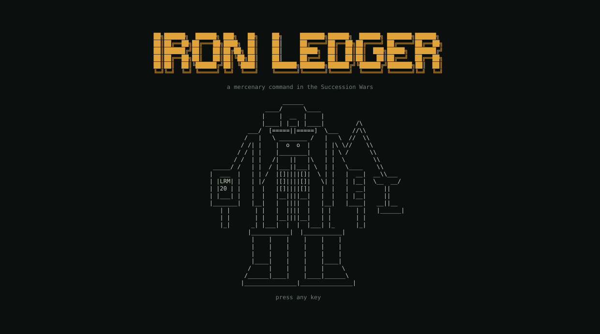

IRON LEDGER is a terminal game about running a BattleTech mercenary
outfit as an organisation: the people, the hulls, the money, the supply
lines and the headquarters that keep a company fighting. You are the
commander of the whole command, not a pilot. Battles resolve on their
own from what you built beforehand — training, maintenance, ammunition,
provisions, morale, support echelons, the depth of your bench — and the
after-action report tells you what your decisions were worth. The
tabletop is deliberately skipped; the campaign around it is the game.

It is written in Zig 0.16 with no dependencies beyond the system SQLite
library, runs in any terminal, and shows your outfit's crest as a real
picture on terminals that support the kitty graphics protocol (Ghostty,
kitty, WezTerm, Konsole).

## What you do

- **Build the outfit.** Create a commander (faction of origin places your
  starter HQ; profession grants a small permanent edge), name the command,
  give it an emblem, generate a company of three line lances, a recon
  lance and a support company, and size the back office.
- **Take contracts.** Twelve contract types from garrison duty to
  planetary assault, priced off your fielded force, with victory points,
  an opposition pool to grind down, breach clauses, and monthly and weekly
  events that land decisions in your inbox with deadlines.
- **Keep them fighting.** Hulls need pilots and techs; techs have hours;
  weapons need munitions per family; people need provisions; wounded need
  a bed you admit them to. A deployed company lives on its own field
  stores and local funds — cash and shipments arrive by courier over real
  transit time.
- **Grow the network.** Regional HQs project influence rings; beachhead
  contracts let you found field HQs beyond them; supply links carry
  tonnage between them with throughput limits; facilities upgrade through
  paperwork and construction and raise the staff you must keep on payroll.
- **Run the books.** Treasuries per outfit, HQ and company; standing
  top-up policies; loans at simple interest against a credit line; the
  option to sell hulls, disband companies or sell off an HQ when money is
  tight. A negative treasury holds the turn. Bankruptcy is game over.
- **Refit in the MekLab.** TechManual construction rules: tonnage, critical
  slots per location, heat, ammo placement. Refits are classed A–D and
  gated by the HQ's mek bay; structure is repaired in a bay with
  fabricated or purchased components.

Everything is turn-based. A day is a turn; nothing happens while you
think, and the end-turn checklist tells you what would slip if you ended
the day now.

## Running it

Requirements: [Zig 0.16](https://ziglang.org/download/), the system SQLite
library (present on macOS; `libsqlite3-dev` on Debian/Ubuntu), and for
music a command-line player on `PATH` — `afplay` (macOS), `mpv`, `ffplay`
or `aplay`.

```sh
zig build test --summary all      # the test suite
zig build run -- --tui            # the game
zig build run -- --tui --ascii    # plain-ASCII borders for terminals that draw box glyphs double-width
zig build run -- --repl           # the scripting / debug console
zig build run                     # a scripted demo campaign
```

Flags: `--store <file>` picks the save file (default `campaigns.db`, one
file holds every player and campaign); `--no-splash` and `--no-music` for
scripts. A maximised terminal at a 14–16 px font gives the full layout;
everything degrades down to 80×24.

### Keys

| Everywhere | |
|---|---|
| `F1`–`F10` or `1`–`9`, `0` | screens: Desk, Map, Forces, Contracts, Ledger, Supply, HQ, Lab, People, Market |
| `Tab` / `Shift-Tab` | move between panes |
| `j` `k` or arrows, `Enter` | move the cursor, act on the row |
| `:` | command line with Tab completion (every console verb works here) |
| `n` / `N` | end the turn / end seven turns — the checklist opens first |
| `?` | help · `M` music on/off · `q` back to the welcome screen |

Each screen's own keys are on its bottom line.

## The screens

### Welcome and settings

Players own campaigns. Continue, create or delete a campaign; create or
delete a player. Deleting asks for the name typed back. Settings hold the
music switch and volume.

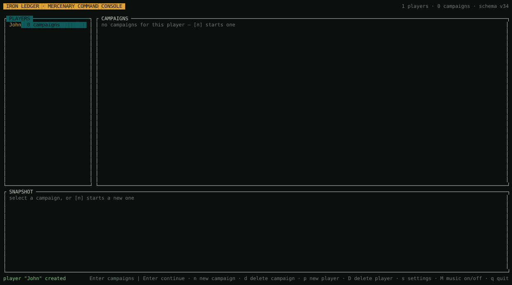

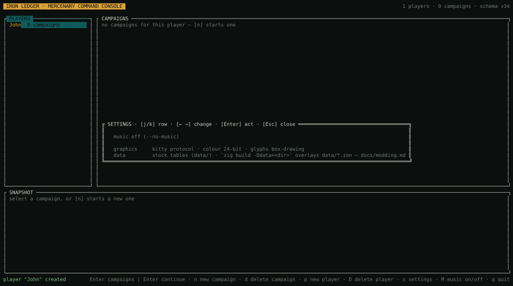

### New campaign

Four steps: commander, outfit and emblem (presets, or import a PNG from
`./`, `logos/` or `docs/logos/`), the generated company with the back
office sized by hand, and a review.

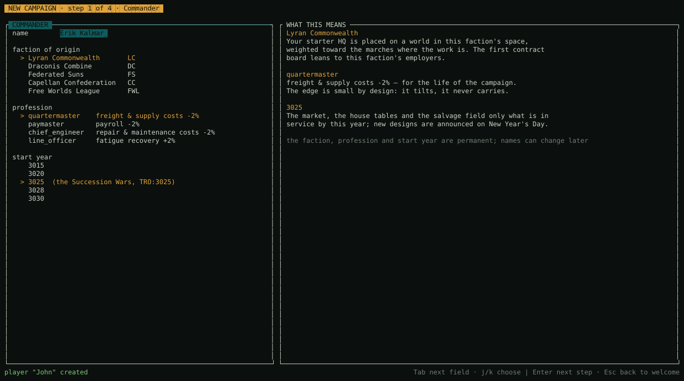

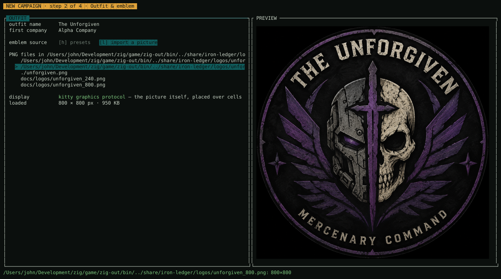

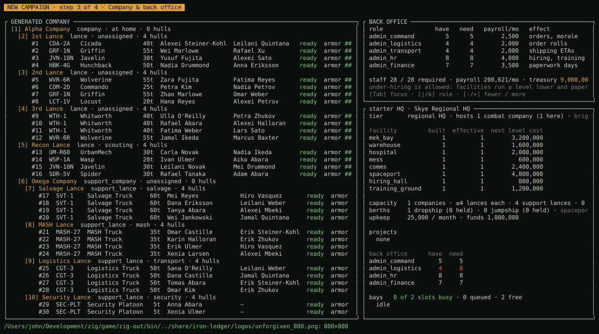

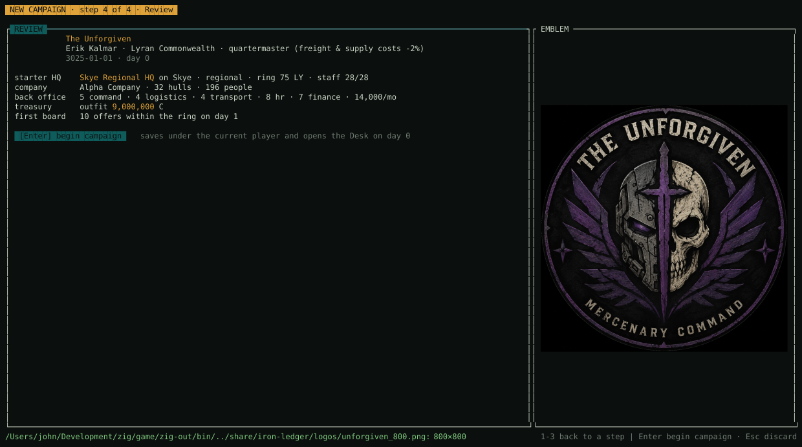

### F1 Desk

Where a turn starts and ends: the end-turn checklist (blocking items in
red), the inbox with decisions and their deadlines, every company's
posture, the log since last turn, and the HQ network.


### F2 Map

The star map from the real planet table: influence rings and beachhead
bands around each HQ, offers pinned to worlds, deployed companies marked.
`h j k l` move between worlds and the view follows the cursor; `+` and
`-` zoom in and out (×1 fits every world, up to ×8 centred on the cursor,
with a count of worlds off screen); `f` founds an HQ on the one under the
cursor.

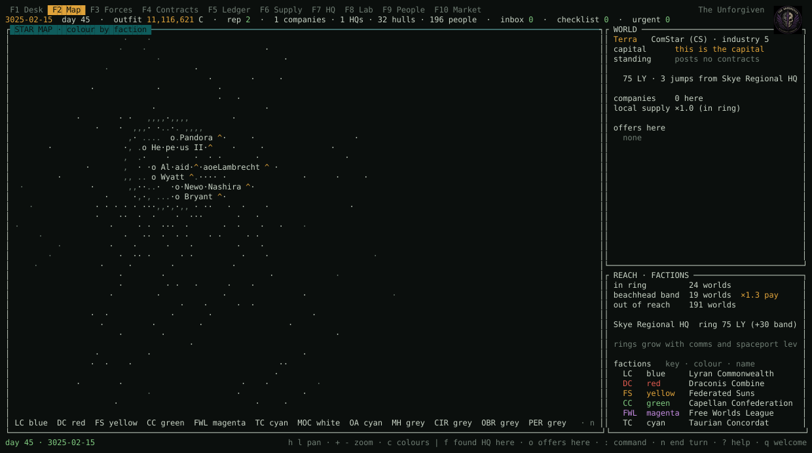

### F3 Forces

The TO&E as a tree with pilot, tech and state per hull; the selected
hull's mounts, ammo and repair needs; the unassigned pool; the person;
the medbay. `o` sets a lance's role (fighting, defense, scouting,
training), `d` sends a hull to the depot, `$` sells one, `X` disbands a
company. Rows flag `struct lt,ra` (depot work, needs a component) and
`gear N` (field work); the cursor on a company opens a DAMAGE pane with
the components the home warehouse must have ready, and `b` fabricates
the one it is shortest of.

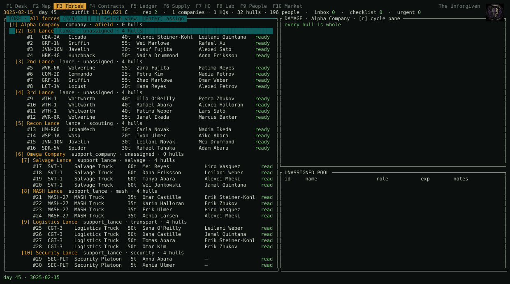

### F4 Contracts

The board with every column that matters, and the active contract with
its opposition pool, duration, victory points, breach exposure, salvage
capacity and battle history. A HISTORY pane keeps every closed
contract with its outcome, world, days served, victory points and pay
received; the log pane follows whichever contract the cursor is on. The
Map marks worlds you have worked with `=`, since an HQ can be founded on
any of them.

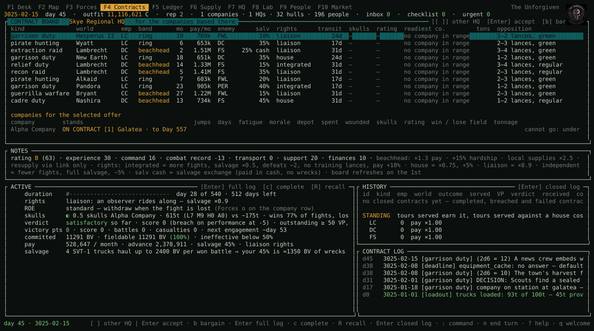

### F5 Ledger

Money lives in places: treasuries, couriers in transit, standing top-up
policies, loans against the credit line, the liquidation value of
everything you own, a P&L in two periods, and the transactions.

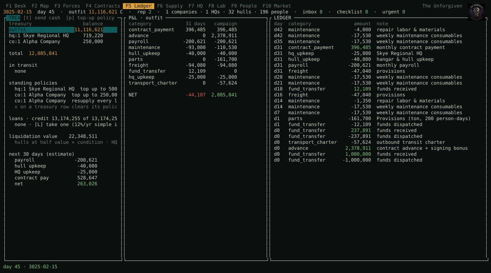

### F6 Supply

Every warehouse and field store as a tonnage bar; the selected site's
stock as a table; everything inbound with delivery days. On a company
row: `t` sends cash by courier, `p` sets a top-up policy, `P` a resupply
policy, `s` ships provisions from home, `o` orders straight to the
field. On an HQ row (or a Market catalogue row) `K` sets a keep-stocked
line: under the minimum, the warehouse reorders or fabricates up to the
target on its own; the Market's KEEP STOCKED pane lists, edits and
removes them. `$` on an HQ row sells part of a line for its resale
value to free warehouse space.

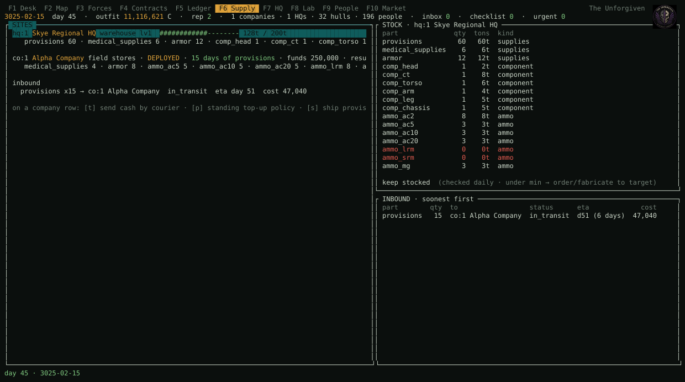

### F7 HQ

Facilities with built and effective level, bays and their queue,
projects, the back office against its requirement, and the hiring hall
with a role filter.

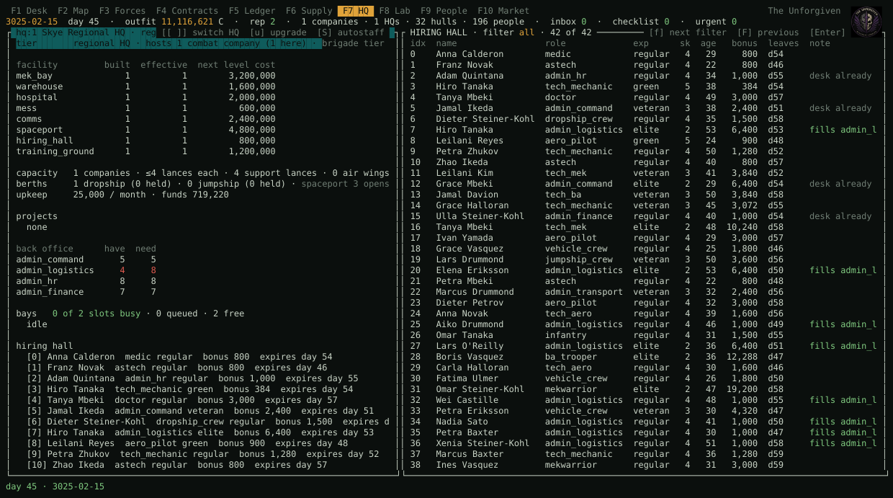

### F8 Lab

The MekLab: tonnage budget, crits per location (dim = full), structure
state with the component it needs, mounts, the staged plan with the
rules' verdict. `+` picks a part and then a location the rules allow;
`R` orders a replacement for damaged gear; `D` sends the hull to the
depot for structural work.

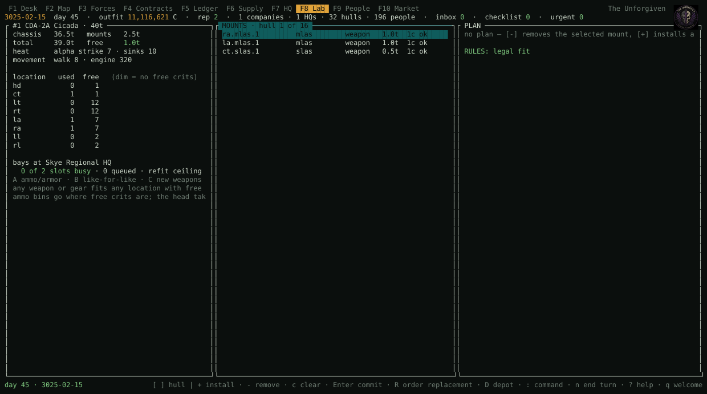

### F9 People

Everyone on the payroll with status, assignment and location; the full
record with skills and XP costs; open seats. `m` admits the wounded to
the medbay — they do not heal until you do, unless Settings (F12) has
auto-admit on.

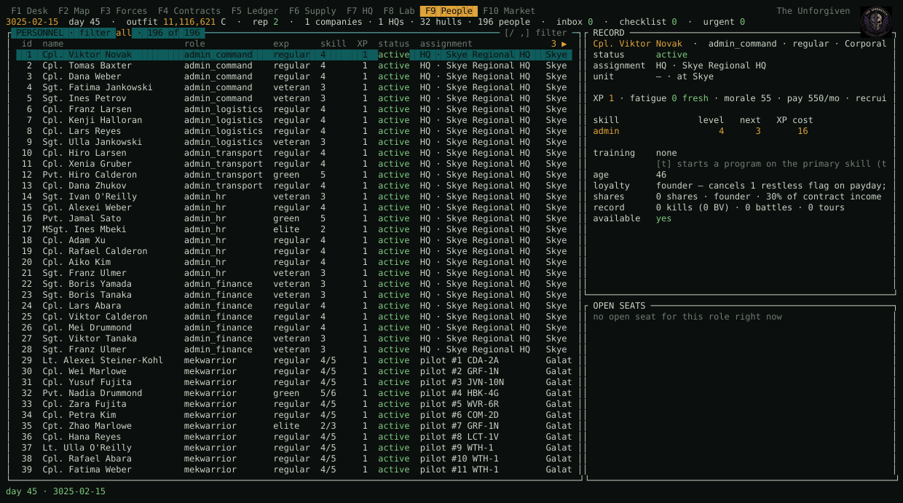

### F10 Market

The site boards for hulls, parts and ammo, an order catalog with
fabrication of structural components, and a demand pane built from every
damaged slot that orders the shortfall.

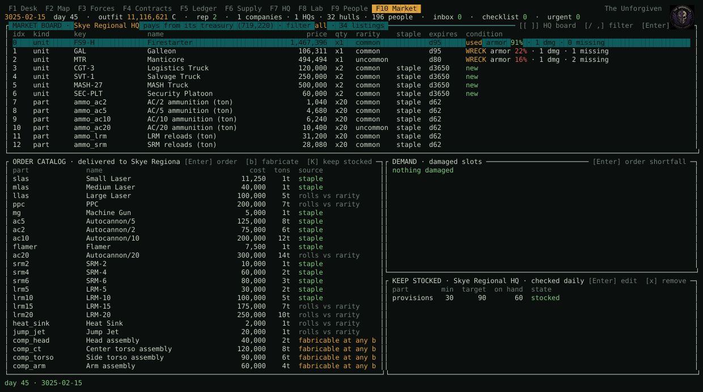

### Ending a turn

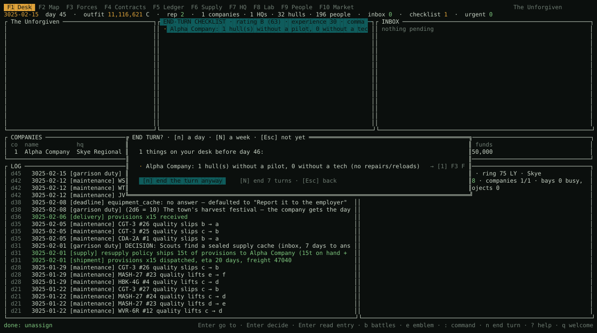

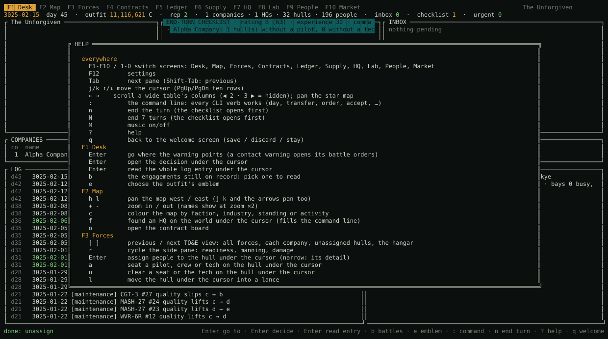

## Design

- `ARCHITECTURE.md` — the sim core is pure and deterministic: no I/O, no
  wall clock, integer C-bills, named RNG streams, commands as a tagged
  union, a golden-master hash for regression.
- `GAMEPLAY.md` — the intended feel and the loops.
- `ROADMAP.md` — the stages, built in order.
- `docs/tui.md` — the terminal client's architecture, with the generated
  mockups in `docs/tui-mockup.html`.
- `docs/mekhq-map.md` — which MekHQ concept each module corresponds to.

The terminal client talks to the simulation only through commands and
queries (`src/sim/commands.zig`, `src/sim/queries.zig`); the console
(`--repl`) uses the same boundary, and `docs/tui_smoke.py` drives the
client through a pseudo-terminal as a test.

## Attribution

IRON LEDGER is inspired by [MekHQ](https://megamek.org/) and the wider
[MegaMek](https://github.com/MegaMek) project, whose campaign systems —
personnel, TO&E, the AtB contract and event model, maintenance, markets,
finances — shaped what this game absorbs and what it leaves out. The
rules it follows come from the BattleTech *Campaign Operations* and
*TechManual* sourcebooks. It shares no code with MegaMek.

BattleTech and 'Mech are trademarks of The Topps Company, Inc. This is a
fan project, unaffiliated with Topps, Catalyst Game Labs or MegaMek.

## License

GNU General Public License v3.0 — see [LICENSE](LICENSE).
